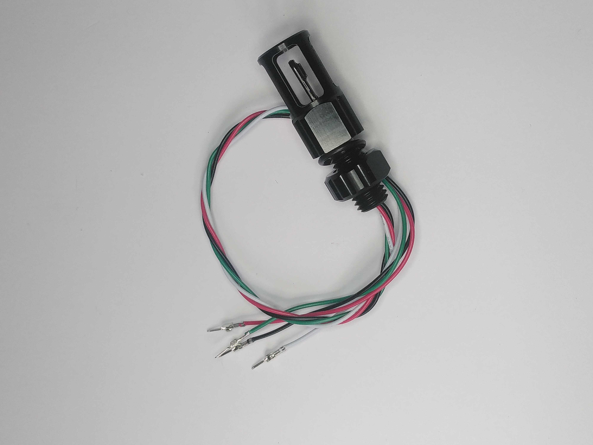
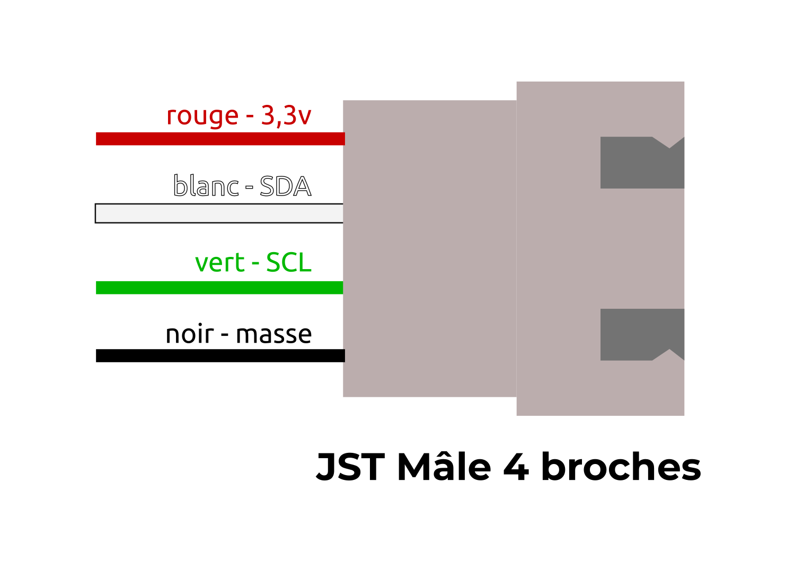
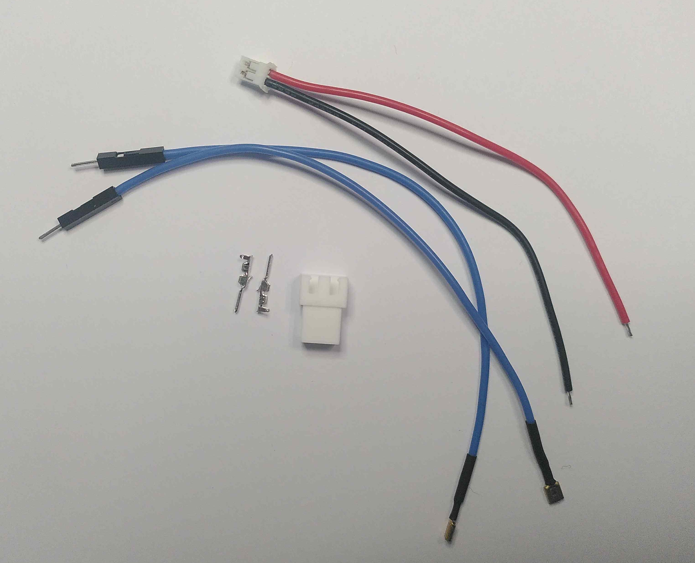
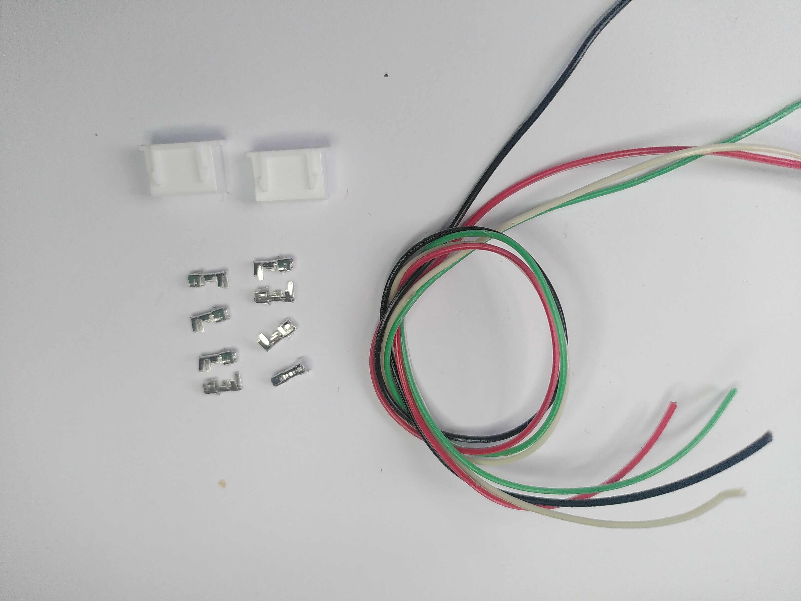

# Guide d'assemblage

## 1/ Préparations, câblages et soudures
### 1.1 Connectique du capteur de température

 - Rassembler le capteur de température (et ses accessoires, le joint et l'écrou), un bloc connectique mâle JST 4 voies (4P Plug Housing), 4 ferrures mâles JST à sertir, ainsi qu'une bride à 2 perforations (ou une plaque alu deux perforations). 

 - A l'aide d'une pince coupante, sectionner le connecteur du capteur déjà en place. Veiller à couper au plus proche du connecteur afin de conserver un maximum de fil.
 - Dénuder chacun des fils au moyen d'une pince à dénuder. 
 - Sertir au bout de chaque fil une ferrure mâle.

<section style="border: 2px solid red; padding: 20px; border-radius:20px; color: red;">
Attention ! Avant de positionner les ferrures dans le bloc connecteur JST, il faudra passer le capteur dans un trou de la bride. Ceci ne pouvant pas être fait après car le connecteur ne passe pas dans la perforation de la bride. </section>

 - Positionner le joint torique du coté extérieur, puis passer le pénétrateur dans la bride, pour enfin serrer avec l'écrou à la main puis à l'aide d'une clé. 

 - Enfoncer chacun des fil dans le connecteur JST. En suivant le schéma ci-dessous. 

### 1.2 Préparation du micro-controleur 

 - Rassembler l'horloge (la carte RTC), et 2 lignes de broches dupont mâle (1* 16 broches et 1* 12 broches).

 - Souder ces deux connecteurs duponts comme suit. 

<section style="border: 2px solid red; padding: 20px; border-radius:20px; color: red;"><b>Attention</b> à veiller à :
<li>Souder les broches sur les emplacements externes</li>
<li>Positionner les broches à l'opposé de l'emplacement de la pile. </li>
<li>Souder les broches les plus courtes.</li>
<li>Veiller à maintenir les broches bien perpendiculaire à la plaque. </li>
</section>

 - Rassembler l'horloge RTC qui viens d'être soudé ainsi que deux nouvelles lignes de broches (1* 16 broches et 1* 11 broches).

 - Souder ces broches à l'opposé des broches installé à l'étape précédente. 

 - Rassembler le microcontrôleur (Adafruit MO), ainsi que deux lignes de broches dupont femelles (1* 16 broches et 1* 12 broches).
 

 - Souder ces broches en veillant au sens. Le coté femelle doit se retrouver au dessus de la carte.
 - C'est ici que viendra se brancher l'horloge RTC. 

 - Enfin, assembler les deux cartes électronique l'une sur l'autre. 
 - L'horloge RTC viendra donc au dessu du micro-contrôleur. 

### 1.3 Assemblage du circuit secondaire
Le circuit secondaire, va permettre dans un premier temps de faciliter les connexions entre capteurs et voyants. Il permet aussi d'ajouter des composants nécéssaires comme les résistances de tirages sur le capteur qui communique suivant le protocole I2C.

 - Rassembler, une plaque de prototypage adafruit, trois connecteurs JST mâles à souder 5, 4 et 2 broches, 2 résistances de 10 kohm, du fil électrique à souder.

 

 - Prendre la plaque de prototypage dans le sens où les lettres des colonnes demeurent dans le bon sens pour la lecture.
 - Souder les 3 connecteurs JST femelles en suivant le plan ci-dessous. Le connecteur 5 broches de G1 à G5, le connecteur de 2 broches de G8 à G9 et le connecteur à 4 broches entre G12 et G15.

 - Au moyen de trois morceaux de fil (de préférence noir) relier chaque ligne (1, 8 et 12) à la colonne de masse symbolisé par un "-".

 - Souder un pont (fil de couleur rouge) entre la ligne 2 et la colonne "+".

 

 - Souder un pont (fil bleu) entre les ligens 3 et 9. Il s'agit du fil de donnée logique pour contrôler le voyant lumineux. 

 - Souder un pont (fil vert) entre les lignes 4 et 13. Il s'agit du SCL, l'horloge pour la lecture du capteur de température. 
 - Souder un pont (fil blanc) entre les lignes 5 et 14. Il s'agit du SDA, le fil de datas pour la lecture du capteur de température. 

 - Souder les deux résistances de 10kohm entre la ligne 13 et le "+" et la seconde entre la ligne 14 et le "+".
 - Se servir d'une des patte de résistance coupé pour faire un pont entre la ligne 15 et la colonne "+".

 
 
### 1.4 Connectiques de la batterie
 - Couper un fil du connecteur de la batterie, le dénuder et le souder à un autre fil de même couleur pour le rallonger de 25cm environ. 
 - Isoler la soudure au moyen de gaine thermorétractable. 
 - Faire de même pour rallonger le second fil. 

<section style="border: 2px solid red; padding: 20px; border-radius:20px; color: red;">Attention pendant cette manipulation à ce qu'aucun fil ne se touche pour éviter un court-circuit.</section>

 - Rassembler, la batterie, un connecteur femelle JST à 3 broches (je n'avais pas de 2 broches dans ma boite) et 3 ferrures JST femelles.
 - Dénuder un fil de la batterie, et y sertir une ferrure femelle. 
 - Insérer cette ferrure dans le bloc 3 broches JST mâle. Veiller à respecter le même sens que sur la photo.
 - Faire de même avec le second fil et l'insérer dans le bloc JST à l'opposé du premier.

 - Rassembler, les fils du boutons (switch) étanche, un connecteur JST de batterie, un connecteur JST mâle 3 broches et 2 ferrures mâle.

 - Couper un fil du switch au ras du connecteur dupont. Dénuder le fil et le souder au fil rouge du connecteur JST batterie. Protéger la soudure avec de la gaine thermorétractable.

 - Couper le second fil du switch au ras du connecteur dupont, le dénuder, et le sertir à une ferrure JST mâle. 
 - Faire de même avec le fil noir du connecteur batterie.

 - Insérer ces ferrures dans le connecteur mâle 3 broches de manière à ce qu'une fois la batterie branché les deux fils noir soit face à face.

 

### 1.5 Connectique du voyant lumineux.
Le voyant lumineux blue robotics, ne requiert pas de résistance additionnelle. 
 - Rassembler, le voyant lumineux, un bloc JST mâle à 3 broches et 2 ferrures mâles.

 - Couper les deux fils du voyant lumineux, les dénuder et y sertir deux ferrures mâles. 

<section style="border: 2px solid red; padding: 20px; border-radius:20px; color: red;">
Attention avant de passer à l'étape suivante, il est important de placer le voyant sur la bride. En effet, le connecteur ne passera pas au travers de l'écrou.</section>

 - Rassembler le voyant lumineux, son joint torique, son écrou et une bride à 2 trous.

 - Passer les fils du voyant lumineux dans le joint torique puis dans un trou de la bride et enfin dans l'écrou.

 - Ne pas graisser le joint qui est en compression. 
 - Serrer à la main pui à l'aide d'une clé.

 - Insérer les ferrures dans un bloc connecteur JST 3 broches.

 - Pour réaliser la rallonge du voyant lumineux, prendre : 4 ferrures JST femelles, 1 bloc JST femelle 3 broches et un autre de 2 broches, ainsi qu'un fil noir et bleu de 25cm environ. 
 - Dénuder et sertir chaque bout de fil. 
 - Insérer les ferrures dans les blocs en veillant aux polarités en se connectant à la carte d'une part et au voyant lumineux d'autre part. On peut torsader les fils.
 

### 1.6 Rallonge du capteur de température
 - Pour réaliser la rallonge du capteur de température, couper 4 morceau de fil de 25cm environ (noir, rouge, vert et blanc). Rassembler aussi 8 ferrures JST femelle et 2 bloc connectiques femelles 4 broches.

 - Insérer les ferrures dans un des blocs à 4 broches en suivant l'ordre de la photo.

 - [Tresser les câbles en suivant ce tutoriel](https://youtu.be/7lTFIzm9BLY?si=LTKGTFpY72lfe2tC)
 - Insérer les ferrures opposés dans le secons bloc à 4 broches en suivant l'ordre de la photo.

### 1.7 Rallonge de la carte microcontrôleur
 - Rassembler 5 fils (noir, rouge, blanc, vert et bleu) de 10 cm environ, 5 ferrures femelles JST, 1 bloc JST 5 broches femelles, 5 ferrures dupont femelles et deux bloc dupont 4 broches. 
 - Dénuder les fils. Sur chcun de fil, sertir une ferrure femelle JST d'un bout et de l'autre une ferrure dupont femelle.
 - Insérer les ferrures JST dans le bloc JST à 5 broches dans le sens indiqué.

 - Insérer les ferrures dupont dans les bloc Dupont 4 broches dans le sens indiqué.
 

### 1.8 Fixation du switch
 - Rassembler tous les composants du switch étanche. C'est à dire, le pénétrateur, le bouton rotatif, l'écrou et 3 joints dont un est plus épais que les deux autres. 

 - Insérer la vis du pénétrateur dans le joint le plus épais de trois. Insérer le pénétrateur dans le second trou de la bride où se trouve déjà le voyant lumineux. Le joint doit se trouver du coté extérieur.

 - Serrer à la main puis à l'aide d'une clé. 
 - Retirer l'écrou (argenté) se trouvant sur le bouton poussoir.
 - Visser le bouton poussoir au bout (coté intérieur) du pénétrateur switch.
 

 - Les deux derniers joints doivent être graissés avec de la graisse silicone.
 - En déposer une légère pointe sur le doit et frotter chacun des joints délicatement. Il ne doit rester aucune goutte.
 - Une fois graissé insérer ces joints dans les rainures du bouton tournant. 

 - Visser le bouton dans le pénétrateur. Si nécéssaire ajouter une pointe de graisse silicone.

 - A l'aide d'un multimètre tester le bon fonctionnement du Switch.

<section style="border: 2px solid red; padding: 20px; border-radius:20px; color: red;">
Attention ! Laisser le bouton ouvert (le courant ne peut passer) pour les étapes suivantes et surtout avant de brancher la batterie au reste du circuit.</section>

## 1.9 Installation de la mise à l'air libre
 - Rassembler le bouchon de mise àl'aire libre (ou vent) et tous ces accessoires ( 1 pénétrateur, 3 joints toriques, 1 écrou.)

## 2. Assemblage final
### 2.1 Agencement intérieur
 - Rassembler la bride qui acuillera le capteur de température et ses joints toriques.

<section style="border: 1px solid green; padding: 20px; border-radius:20px; color: green;">
ⓘ Info ! Dans notre cas, une de nos deux brides étaint composé d'une flange à insérer dans le tube et d'une plaque d'aluminium percé que l'on vissait sur la flange. Les dernières versions commercialisés sont faites d'un seul bloc.</section>
 - Graisser à l'aide de graisse silicone au doigt les deux joints.
 - Les insérer dans leurs gorges respectives. 
 - Rassembler la rondelle R1, 4 vis M3*6mm et la bride contenant le capteur de température.
 - Visser R1 sur la bride comportant le capteur de température. 
 - Assembler le support S1 avec la rondelle R1 et la R2, de manière à positionner l'encoche arrondi de S1 du coté de R1. 
 - Placer la batterie sur son support S1 au moyens de deux colliers de serrages. 
 - Ces dernier devront passer dans les encoches sur le coté du support S1 afin de ne pas gêner l'insertion de l'ensemble dans le tube. 
 - Passer les câble de la batterie et du capteur de température au travers de R2. 
 - Rassembler le support S2, la carte adafruit addlogger, la carte RTC (les désolidariser) et 4 vis M2,5*5mm. 
 - Visser la carte RTC sur le support S1 en respectant lesens sur la photo. 
 - En dessous de la carte RTC brancher la carte adafruit addaloger M0.
 - Rassembler la carte secondaire et 2 vis M3*5mm. 
 - Visser la carte secondaire sur le support S1 comme présenté sur la photo ci-dessous. 
 - Positionner les rondelles R3 et R4 à chaque extrémité de S2. R3 viendra coté carte secondaire et R4 coté circuit RTC.

### 2.2 Branchements
 - A l'aide du câble fabriqué à 4 fils, relier le capteur de température au connecteur JST 4 broches de la carte secondaire. 
 - Faire de même avec la rallonge du voyant lumineux qui permettra de relier le voyant au bloc 2 broches de la carte secondaire. 
 - Brancher le câble de la batterie, premièrement sur le switch puis sur la carte adafruit addaloger M0 puis connecter la batterie. 
 - Connecter le câble (5 fils), connecteur JST femelle sur le conecteur 5 broches de la carte secondaire. 
 - Connecter les autres extrémités sur les broches du RTC comme indiqué sur le schéma ci-dessous. 

### 2.3 Fermeture du tube
 - Insérer le tout dans le tube.
 - Enfoncer la bride contenant le capteur de température d'un bout. 
 - Veiller à ce que l'encoche soit placé dans l'encoche du tube PMMA. 

<section style="border: 2px solid red; padding: 20px; border-radius:20px; color: red;">
Attention ! Afin de fermer un tube étanche : 
<li>Ne pas forcer, graisser les joints légèrement et sans surplus.</li>
<li>Veiller aux éléments fragiles comme le capteur de température</li>
<li>Ouvrir le bouchon de la mise à l'air libre pour ne pas créer de surpression</li>
</section>
 - Fermer la bride du coté opposé. 

### 2.4 Points d'accrochages
 - Chambr à air, colliers de serrages et bout. 