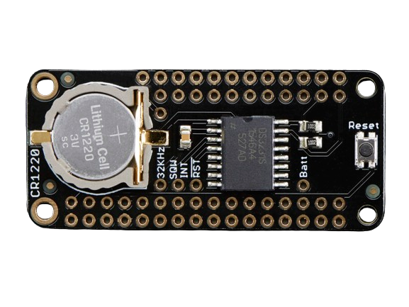
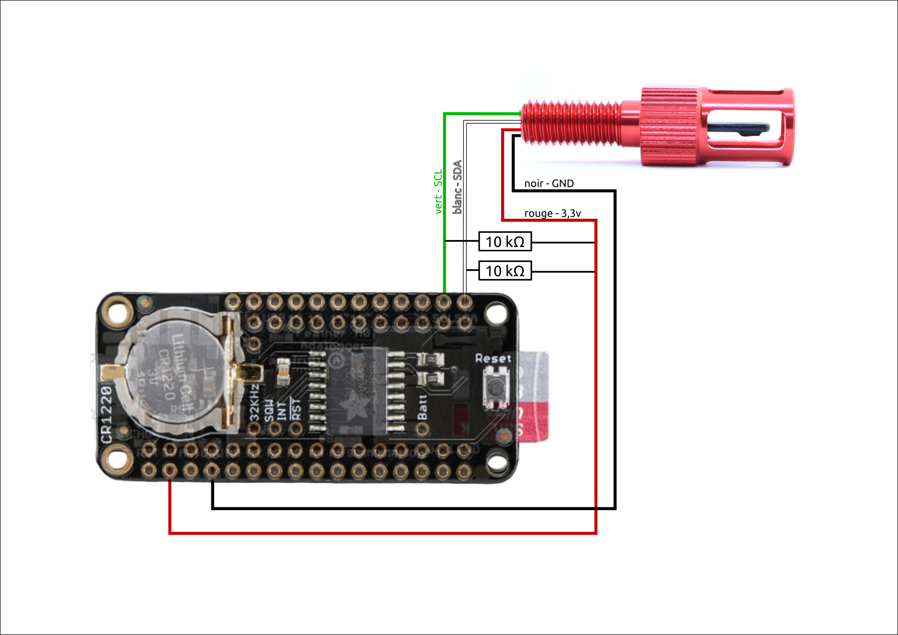

# 0-0-1 -- Test de l'horloge RTC


## 1/ Introduction
Dans cette étape qui viens après l'essai du capteur de température, je vais détailler comment j'ai ajouté les données de temps (Date et heure) au moyen d'un shield RTC. 

Le RTC (Real Time Clock) est un circuit qui au moyen d'une pile peut garder en mémoire l'heure. Ainsi lorsque l'on rallumera la sonde, elle sera toujours à l'heure. Dans la limite de la pile évidemment. 



## 2/ Matériel et fournitures
### 2.1 Fournitures
 - Adafruit adalogger M0 ;
 - Module RTC (DS3231 RTC Featherwing) ;
 - Pile bouton CR1220 ;

### 2.2 Matériel
 - PC sur windows (de préférence) ou linux ;
 - Câble USB vers micro USB ;
 - Logiciel [Arduino IDE](https://www.arduino.cc/en/software) ;

## 3/ Réalisation
### 3.1 Hardware
Pour connecter la carte Adafruit M0 au shield RTC, il est nécéssaire de souder dans un premier temps des connecteurs duponts. **Pour cela, se référer au guide d'assemblage** afin d'éviter de devoir déssouder les broches pour fabriquer la sonde. 

 - Connecter l'Adafruit et le shield RTC en les superposant. 
 - Installer la pile bouton CR1220 dans l'emplacement prévu à cet effet. Positionner la face gravé vers le haut. 

*Ce visuel tente de montrer les deux cartes positionés l'une sur l'autre.*

### 3.2 Software
#### 3.2.1 Mise à l'heure

Avant toute chose, il faut initialiser l'horloge, en lui entrant la bonne heure. La question qui se pose est qu'elle heure ? 
 - **L'heure locale ?** : Dans ce cas si la sonde voyage, il peut-être difficile de s'y retrouver. 
 - **Ou l'heure universelle (UTC) ? **: Mais une telle initialisation demande une manipulation particulière. 

#### 3.2.2 Programme qui marche
Ce programme en C++ fonctionne avec l'horloge et le capteur de température.
Toutes les secondes, le programme renvoi dans le moniteur série la date, l'heure et la  
```c++
//Date and time functions using a DS3231 RTC connected via I2C and Wire lib
#include <Wire.h>
#include "RTClib.h"

//Librairie pour lire le capteur de température
#include "TSYS01.h"

TSYS01 sensor;
RTC_DS3231 rtc;
//RTC_PCF8523 rtc; //décommenter si utilisation de ce RTC

// Définition des variables
float temp;


void setup() {

  Serial.begin(9600);

  if (! rtc.begin()) {
    Serial.println("Couldn't find RTC");
    while (1);
  }
  //Initialize real-time clock
  if (rtc.lostPower()) {

    //reset RTC with time when code was compiled if RTC loses power
    Serial.println("RTC lost power, lets set the time!");
    rtc.adjust(DateTime(F(__DATE__), F(__TIME__)));
  }

  delay(250);   // Wait a quarter second to continue.
  
  Serial.println("Starting mesurements");
  
  Wire.begin();

  sensor.init();

}

void loop() {

 DateTime now = rtc.now(); //check RTC
    char dateTimeString[40];
    get_date_time_string(dateTimeString, now);
    
  sensor.read();
  //output readings to serial
  Serial.print("Time: ");
  Serial.print(dateTimeString);
  Serial.print(" , ");
  Serial.print("Temperature: ");
  Serial.print(sensor.temperature()); 
  Serial.println("°C");


  delay(1000);
}

void get_date_time_string(char* outStr, DateTime date) {
  // outputs the date as a date time string,
  sprintf(outStr, "%02d/%02d/%02d,%02d:%02d:%02d", date.year(), date.month(), date.day(), date.hour(), date.minute(), date.second());
  // Note: If you would like the date & time to be seperate columns change the space in the formatting string to a comma - this works because the file type is CSV (Comma Seperated Values)
}

```

## 4/ Références et développement. 
 - [Tutoriel -- Usage d'une horloge DS3231 avec Arduino](https://passionelectronique.fr/tutorial-ds3231/)
 - [Le programme est inspiré de celui proposé par l'Open CTD (License MIT pour Oceanography for everyone)](https://github.com/OceanographyforEveryone/OpenCTD/tree/main)