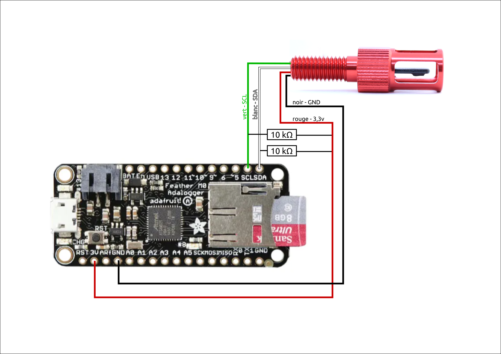

# 0-0-1 -- Test du capteur de température


## 1/ Introduction

Le capteur de [température de blue robotics](https://bluerobotics.com/store/sensors-cameras/sensors/celsius-sensor-r1/) a une précision de 0,1°C et doit être impérativement utilisé avec une tension de 3,3v. 
Dans le cas d'un usage prévu avec une arduino, Blue robotics, recommande d'utiliser un [convertisseur de niveau I2C](https://bluerobotics.com/store/comm-control-power/tether-interface/level-converter-r1/). 

</br>
*Image : © [blue robotics](https://bluerobotics.com/)*


Comme tout câblage I2C, celui-ci contient 4 fils. 
 - Rouge : Vin (3,3v)
 - Noir : GND
 - Blanc: SDA (data)
 - Vert : SCL (clock)

</br>
*Image : © [blue robotics](https://bluerobotics.com/)*

## 2/ Matériel et fournitures
### 2.1 Fournitures
 - Adafruit adalogger M0 ;
 - [Capteur de température de blue robotics](https://bluerobotics.com/store/sensors-cameras/sensors/celsius-sensor-r1/) ;
 - 2 résistances de 10kΩ ; 
 - Fils de prototypages Arduino ;
 - Plaque de prototypage ; 

### 2.2 Matériel
 - PC sur windows (de préférence) ou linux
 - Logiciel [Arduino IDE](https://www.arduino.cc/en/software)

## 3/ Réalisation
### 3.1 Hardware
Pour réaliser le test de fonctionnement du capteur de température, j'ai utilisé : 
 - Adafruit adalogger M0
 - Platine de prototypage
 - 2 résistances 10kΩ
 - Le capteur de température I2C

Réaliser les branchements suivants. On pourra sectionner le connecteur du capteur de température pour utiliser les fils dénudés. 
</br>


### 3.2 Software
J'ai réalisé le premier test au moyen du programme proposé par [la documentation de blue robotics](https://bluerobotics.com/learn/celsius-temperature-sensor-installation-and-example-code/). 
 - Télécharger et installer la [librairie Arduino TSYS01](https://github.com/bluerobotics/BlueRobotics_TSYS01_Library)
 - La [la documentation de blue robotics](https://bluerobotics.com/learn/celsius-temperature-sensor-installation-and-example-code/) indique d'utiliser [convertisseur de niveau I2C](https://bluerobotics.com/store/comm-control-power/tether-interface/level-converter-r1/). Dans le cas d'usage d'une adafruit M0 dont l'I2C est en 3,3v, il est possible de faire le branchement en directe. 
 - Brancher la carte adafruit M0 sur l'ordinateur au moyen d'un câble USB. 
 - Lancer votre logiciel Arduino IDE et copier coller ce programme : 
```c++
#include <Wire.h>
#include "TSYS01.h"

TSYS01 sensor;

void setup() {

  Serial.begin(9600);
  
  Serial.println("Starting");
  
  Wire.begin();

  sensor.init();

}

void loop() {

  sensor.read();
 
  Serial.print("Temperature: ");
  Serial.print(sensor.temperature()); 
  Serial.println(" deg C");
   
  Serial.println("&#8212;");

  delay(1000);
}
```

 - Téléverser le programme en sélectionnant :
 	- Le port comm correspondant à la carte branché sur USB ; 
 	- Le bon type de carte ; 
 
 - Ouvrir le moniteur série en sélectionnant "9600". 
 - Ce dernier devrai renvoyer quelque chose comme : 

```
Starting
Temperature: 19.06 deg C
&#8212;
Temperature: 19.07 deg C
&#8212;
Temperature: 19.07 deg C
&#8212;
```

## 4/ Références et développement. 
### 4.1 La valeur de la température était remplacé par "ovf"
 - La mention "ovf" veut dire "overflow", la chaine de caractére est trop longue.
 - Dans mon cas, il s'agissait des connectiques JST qui étaient défectueuses. J'ai donc refais la connectique du capteur entièrement.  