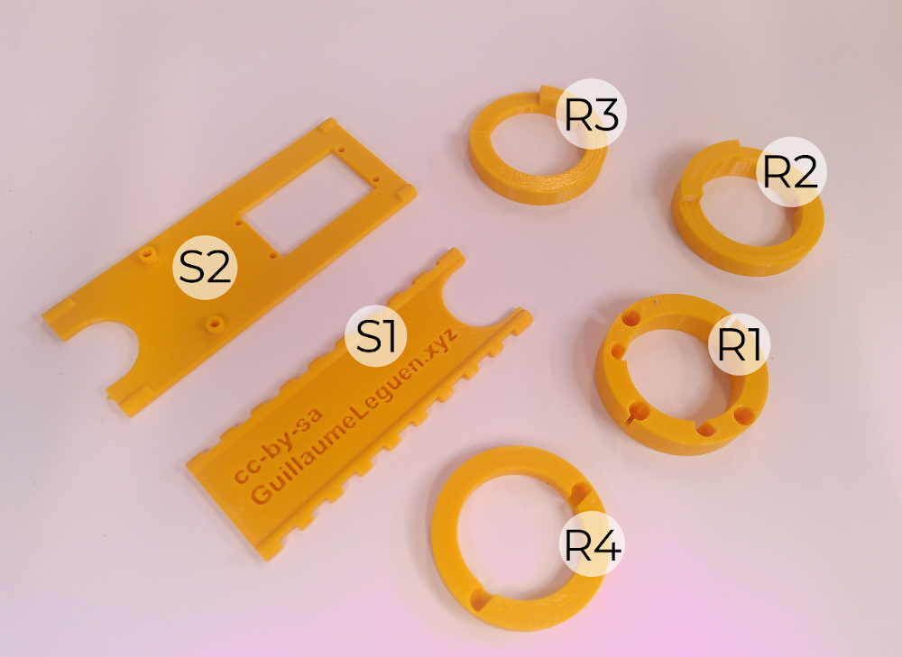
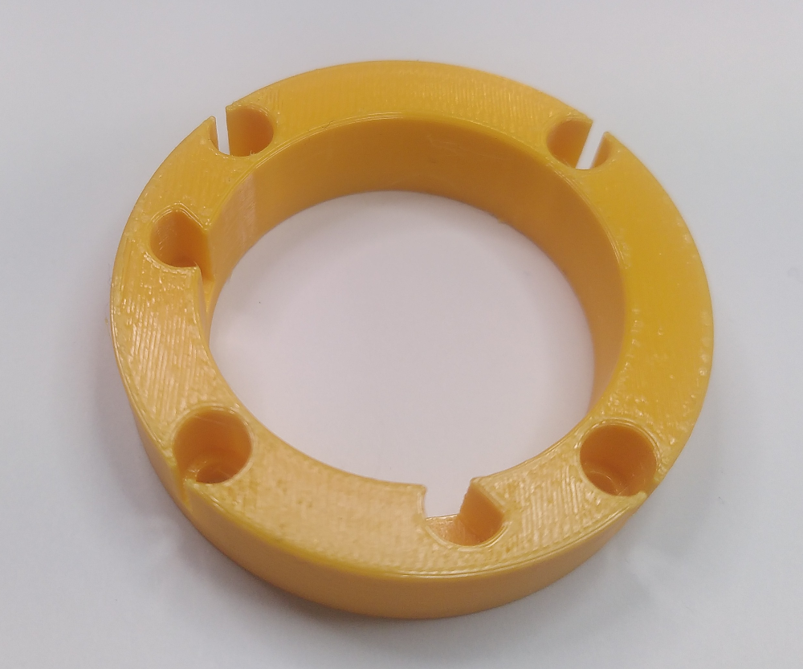
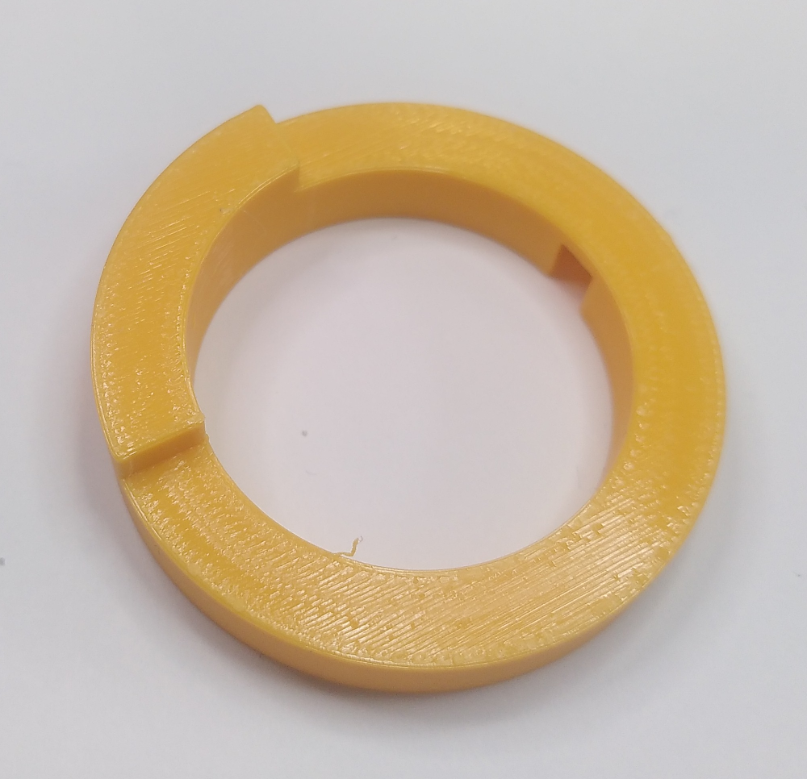
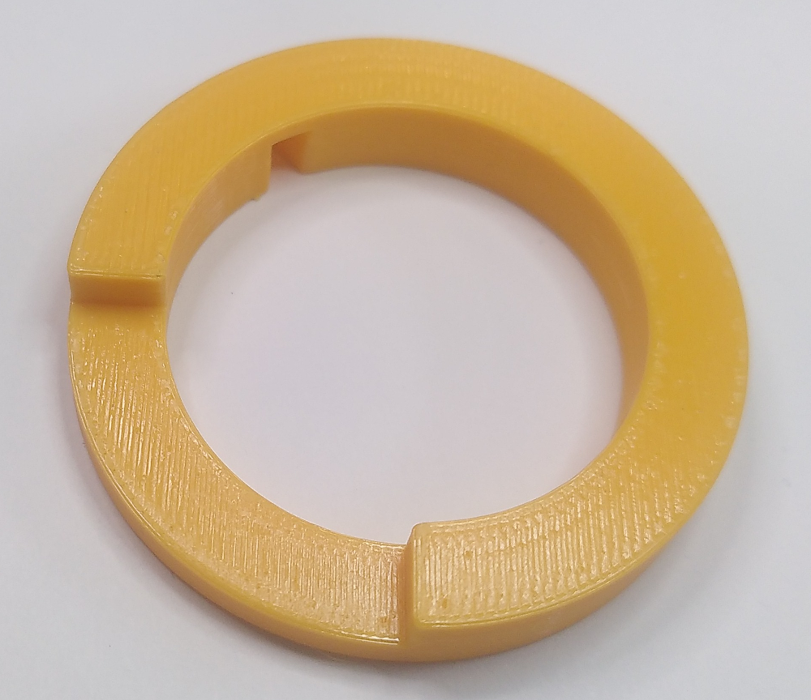
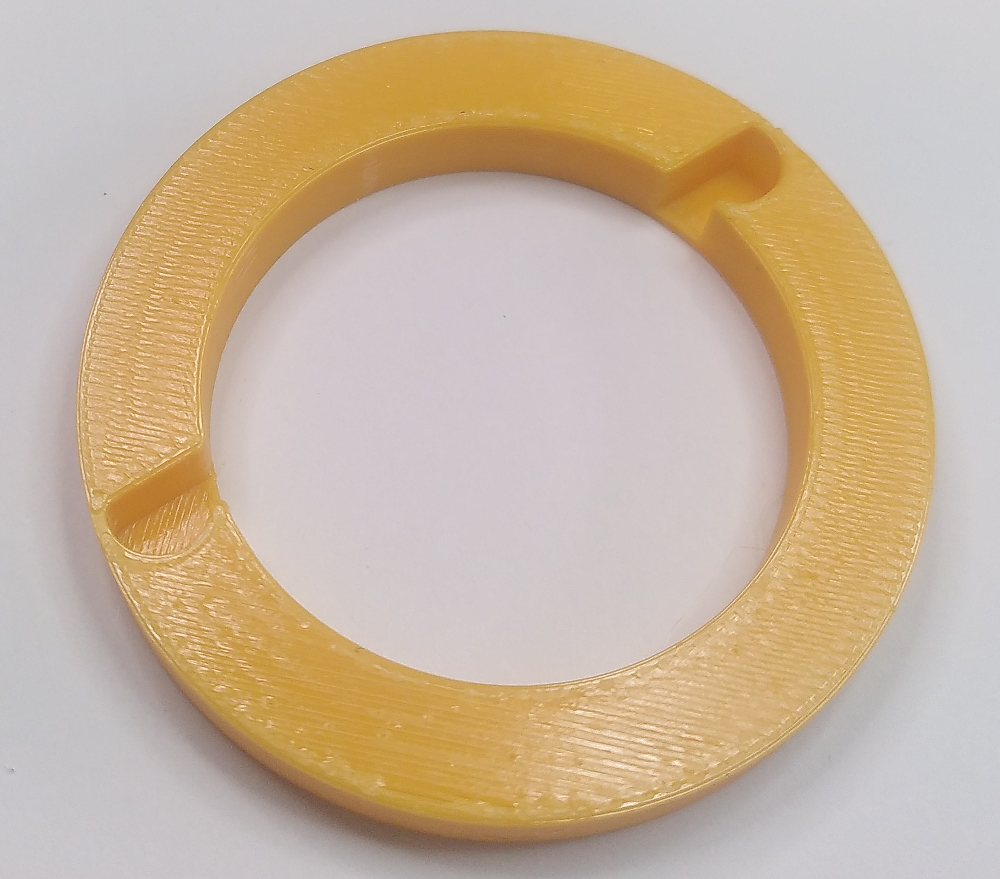
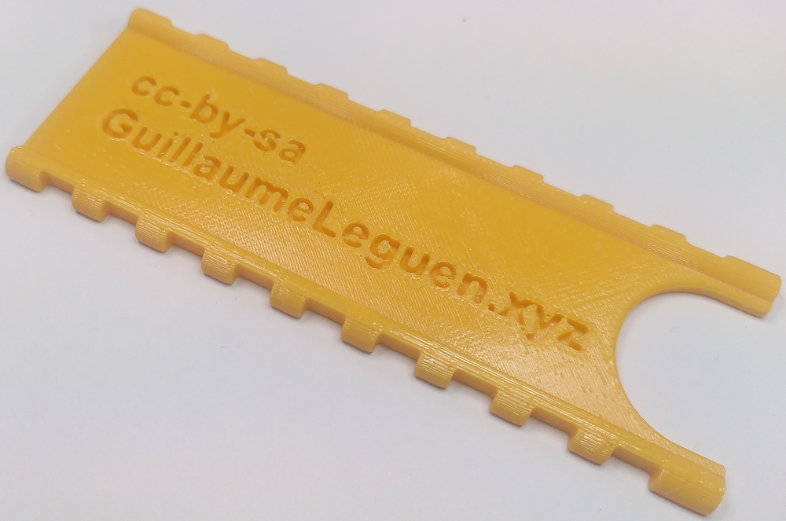
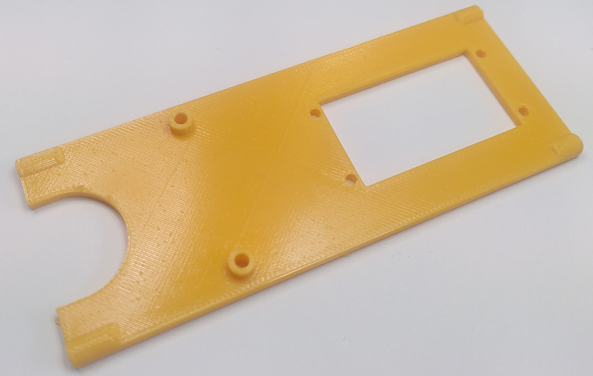

# B. Préparation des pièces (v1.0)
## 1/ Impression des pièces en 3D

Imprimer toutes les pièces nécessaires en veillant à respecter les recommandations de remplissage des pièces extérieurs. 

 * [Les fichiers STL sont disponibles ici](https://github.com/gheleguen/open_educational_ocean_recorder/hardware/3Dprints/v0-1-0).

**1.1 Pour l'intérieur du caisson :**

Il n'y a pas d'obligation quand au matériau d'impression de ces pièces. Le PET est le matériau que nous avons utilisé du fait qu’il est très facilement accessible dans le commerce. Le PLA parait à écarter tant parfois il arrive au à la sonde d'être stocké au soleil. La température si elle atteint 60° pourrait déformer des pièces en PLA. 

Le remplissage pourra être alvéolé de manière à économiser de la matière. Nous utilisons régulièrement un remplissage à 20% et une résolution de 0,2mm.

|    Visuel    |Référence|Quantité|Dénomination et usage|
|------------------------------------|------|------|-----------------|
||[R1](https://github.com/gheleguen/open_educational_ocean_recorder/blob/main/hardware/3Dprints/v0-1-0/R1.stl)|1|Rondelle permettant de visser le support de batterie à la bride basse.|
||[R2](https://github.com/gheleguen/open_educational_ocean_recorder/blob/main/hardware/3Dprints/v0-1-0/R2.stl)|1|Baggue haute du support de batterie. Elle est constitué d'un créneau permettant de s'imbriquer dans le support de carte électronique.|
||[R3](https://github.com/gheleguen/open_educational_ocean_recorder/blob/main/hardware/3Dprints/v0-1-0/R3.stl)|1|Bague basse de support de carte électronique. Un creux permet de bloquer l'angle avec le support de batterie.|
||[R4](https://github.com/gheleguen/open_educational_ocean_recorder/blob/main/hardware/3Dprints/v0-1-0/R4.stl)|1|Bague du haut de la sonde au dessus du support des cartes électroniques|
||[S1](https://github.com/gheleguen/open_educational_ocean_recorder/blob/main/hardware/3Dprints/v0-1-0/S1.stl)|1|Support de batterie. Les créneaux permettent de fixer les batteries au moyen de colliers de serrages.|
||[S2](https://github.com/gheleguen/open_educational_ocean_recorder/blob/main/hardware/3Dprints/v0-1-0/S2.stl)|1|Support des cartes électroniques.|

​

