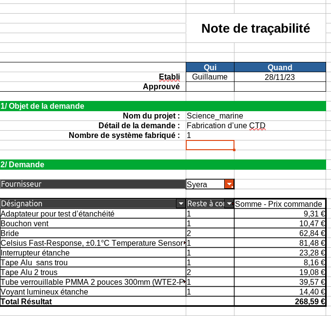

# A. Nomenclature / Le sourcing (V1.0)

Le sourcing est la première étape du projet et souvent la plus fastidieuse. Sourcer désigne le fait de rassembler tout ce qui sera nécéssaire pour fabriquer un objet libre. Ce projet demande des composants que l'on trouvera chez un grand-nombre de fournisseurs différents. De plus, ces fournisseurs peuvent différer en fonction du lieu et du moment où l'on va construire un instrument.

**Attention :** Veiller à effectuer ce travail préparatoire bien avant la fabrication. En effet, certaines commandes peuvent avoir de long délais. Et cela sans compter le temps nécessaire pour le travail du sourcing lui-même. 

## 1. Présentation du fichier de sourcing

 - Chercher dans le dossier "docs/files/sourcing" directement dans l'archive github, le tableur qui conviendrait à votre région ou plus proche en temps de votre date d'achat. 
 - Ouvrir le fichier de sourcing au moyen d'un tableur. Ce fichier a été créé au moyen du logiciel libre [Libre office calc](https://fr.libreoffice.org/download/telecharger-libreoffice/) mais pourra très bien être ouvert par d'autres logiciels de tableurs.

 - Ce fichier se compose d'un onglet listant tous les composants et plusieurs autres onglets dont chacun permettra au moyen d'un tableau croisé dynamique de réaliser des notes de traçabilités (ceci permettra de faciliter le travail de validation par votre administration avant l'achat):
 

### 1.1 Détails du tableau "Liste des éléments"

 - **Catégorie :** Catégorie de composants (ex : Electronique, Visserie...)
 - **Désignation :** Appellation du composant
 - **Détails :** Information complémentaire, souvent des détails auquel faire attention.
 - **Qt / Unité :** Quantité pour un instrument,
 - **Qt :** Quantité nécessaire totale pour tous les instrument que l'on souhaite fabriquer,
 - **Fournisseur :** Nom du fournisseur,
 - **Lien :** Lien d'achat,
 - **Prix unitaire :** Prix d'un seul composant,
 - **Prix / Unit :** Prix des composants de même nom pour un seul instrument,
 - **Prix totale :** Prix des composants de même nom pour tous les instruments que l'on souhaite fabriquer,
 - **Stocks :** Nombre de pièces déjà en stock,
 - **Reste à commander :** Nombre de pièces qu'il reste à commander,
 - **Prix commande :** Prix total de chacun des groupes de composants qu'il reste à commander,
 - **Etat de la commande :** Cette colonne permet de sélectionner l'état de l'approvisionnement pour chacun des composant listé. Il existe 4 états : "A commander", "En attente de réception", "Reçu" et "Colis perdu"
 
 
### 1.2 Détails d'une table "note de traçabilité"

 - Dans la seconde partie on pourra modifier au moyen d'un menu déroulant le nom du fournisseur. 
 - Le nombre de composants et les prix affichés correspondent aux quantités après déduction du stock (cf. 1.1 Détails...)
 - Noter que si la valeur renseignée dans la colonne "stocks" de la table "Liste_Materiel" est supérieure ou égale à la quantité totale nécéssaire, la quantité restante à acheter sera de 0. 

## 2. Utilisation du tableur pour sourcer

### 2.1 Mettre à jour les informations des composants

 - Se rendre dans l'onglet "Liste_Matériel"
 - Toutes les cases colorés en jaune sont à éditer en priorité : Changer le nombre d'instruments désirés et remplir la colonne des stocks (colonne"N"). Renseigner "0" si aucun composant en stock.
 - Consulter chaque lien un par un (colonne"H"), vérifier que le fournisseur convient, que le prix unitaire correspond bien à celui indiqué dans le tableau. Dans le cas contraire modifier la valeur dans la colonne "I".
 - Si le fournisseur ne distribue plus ce composant, ou que le fournisseur ne convient pas, chercher le composant ailleurs puis mettre à jour les colonnes "G" "H" et "I" avec les informations du nouveau fournisseur.
 - Surveiller ainsi ces éléments pour chacune des lignes de l'onglet "Liste_Materiel".

### 2.2 Actualiser les notes de traçabilités

 - Éditer l'entête et la partie "1/" comme désiré,
 - Pour mettre à jour la table croisée, cliquer droit sur "fournisseur" puis "actualiser",
 - Créer un onglet pour chaque fournisseur listé. 
 

## 3. Contribuer

Dans le cas où vous avez modifié le tableur avec des fournisseurs différents ce due au fait que vous ne résidez pas dans la même région ou pour toute autre raison, vos informations pourraient bénéficier par la suite à d'autres personnes.

**Pour contribuer**, déposez votre fichier dans le git à l'emplacement suivant "docs/files/sourcing"
