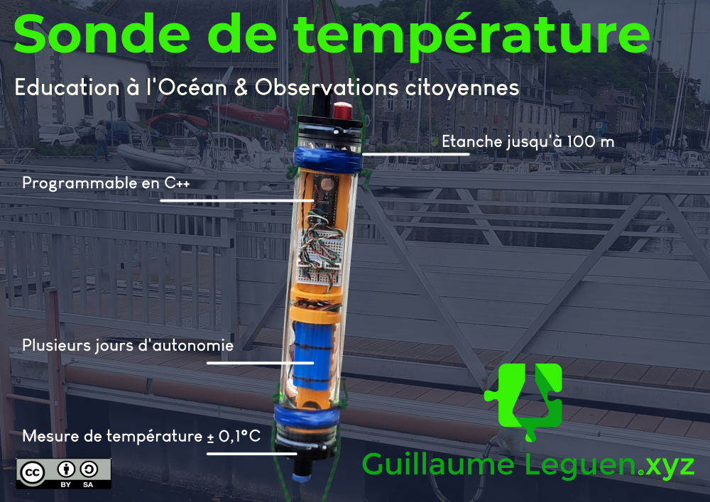

# Sonde de température de fond
## 1/ Introduction
Cette sonde est un instrument permettant d'enregistrer la température de fond marin avec un précision de l'ordre du dixième de degrés Celsius. 
Elle a été conçu pour permettre un simple enregistrement de la température de l'eau en fonction du temps. 
La sonde est disigné de manière à pouvoir recevoir de nouvelles fonctions comme la mesure de la pression ou de la conductivité. 



## 2/ Toutes les clés pour se lancer

### 2.1 Télécharger l'archive

Avant toute chose, [télécharger l'archive du projet](https://github.com/gheleguen/open_educational_ocean_recorder/archive/refs/heads/main.zip). C'est dans ce dossier que se trouve tous les fichiers de documentations mais aussi les fichiers de découpes ou les modèles d'impression 3D. 


**Ou passer par Git Hub**

Se rendre dans le [git hub](https://github.com/gheleguen/open_educational_ocean_recorder.git) et télécharger l'archive complète du projet. 

**Ou en lignes de commandes**

 - Ouvrir un terminal linux,
 - Si ce n'est pas déjà fait installer ```git``` : <pre>sudo apt install git</pre>
 - Se placer dans le dossier de votre ordinateur où vous souhaitez enregistrer l'archive.
 - Cloner l'archive : <pre>git clone https://github.com/gheleguen/open_educational_ocean_recorder.git</pre> 


### 2.2 L'arborescence de l'archive

 - **docs :** Est le dossier qui contient les documents et images qui constituent la documentation.  Ce sont des fichiers marckdown (.md) que l'on peut ouvrir avec un éditeur de texte.

 - **Hardware :** Le dossier qui contient les fichiers d'impressions 3D, de découpe laser...  

 - **Software :** Le dossier qui contient le code à flasher sur l'arduino.
